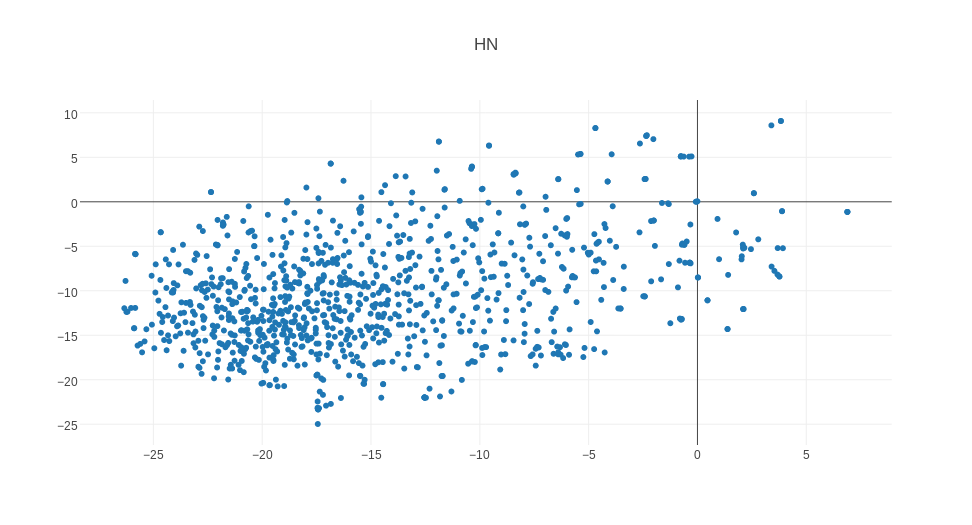

# Clustering Hacker News post titles

A simple method of clustering and viewing Hacker News posts.

Data obtained from https://www.kaggle.com/hacker-news/hacker-news-posts.

## Example plot

This screenshot shows the first 1000 titles clustered.

For an interactive plot, see it [directly on Plotly](https://plot.ly/~insectatorious/0/hn/?share_key=0lYgWDNOnSdCvdk6mb2qjq).

## Requirements 

- [Numpy](http://www.numpy.org/)
- [Pandas](http://pandas.pydata.org/)
- [Scikit-learn](http://scikit-learn.org/stable/)
- [t-SNE](https://lvdmaaten.github.io/tsne/) (for dimensionality reduction)
- [Gensim](https://radimrehurek.com/gensim/)
- A pre-trained Word2Vec model (eg [this model trained on the Google News corpus](https://drive.google.com/file/d/0B7XkCwpI5KDYNlNUTTlSS21pQmM/edit?usp=sharing))
- [Plotly](https://plot.ly/feed/) (this is just for visualising, feel free to use any other library).
